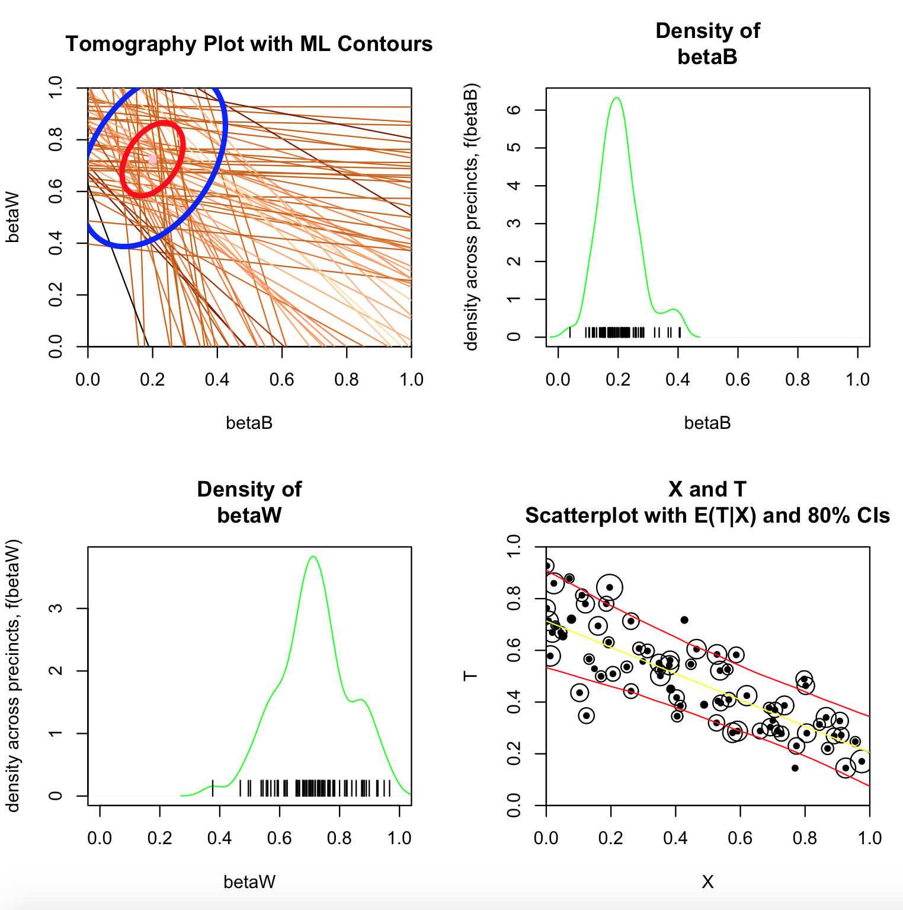

**ZeligEI** is an module with additional models for the Zelig statistical package in R.

Project page and publications available at: 
http://zeligproject.org

Issues should be added to the main Zelig issue queue rather than this repository, available at: https://github.com/iqss/zelig/issues
 

